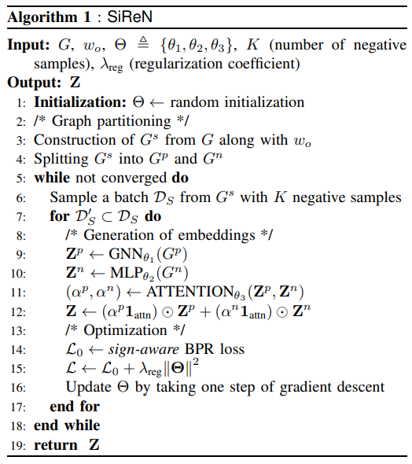
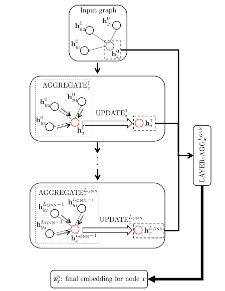
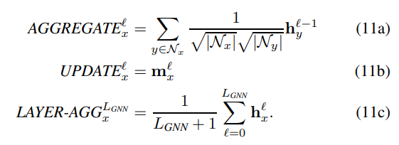

## Sign-Aware Recommendation Systems with Graph Neural Networks (SiReN)

### This is PyTorch implementation code for paper:

> C. Seo et al., SiReN: Sign-Aware Recommendation Using Graph Neural Networks, 
>
> [Paper in arXiv](https://arxiv.org/abs/2108.08735)


### Example : ML-1M dataset

```python
python main.py --dataset ML-1M --version 1 --reg 0.1
```

### Example : Amazon-Book dataset

```python
python main.py --dataset amazon --version 1 --reg 0.05
```

### Example : Yelp dataset

```python
python main.py --dataset yelp --version 1 --reg 0.05
```

### Tree
```
.
├── [1.2K]  convols.py
├── [2.4K]  data_loader.py
├── [5.5K]  evaluator.py
├── [342K]  images
│   ├── [ 47K]  aggregation.png
│   ├── [123K]  algorithm.png
│   ├── [ 29K]  lightgcn.png
│   ├── [ 32K]  lrgccf.png
│   └── [106K]  model.png
├── [5.7K]  main.py
├── [392K]  nbs
│   ├── [165K]  T087038_Sign_Aware_Recommendation_Using_Graph_Neural_Networks_on_ML_1m_Dataset_in_PyTorch.ipynb
│   ├── [138K]  T158246_Sign_Aware_Recommendation_Using_Graph_Neural_Networks_on_Yelp_Dataset_in_PyTorch.ipynb
│   └── [ 85K]  T890631_Sign_Aware_Recommendation_Using_Graph_Neural_Networks_on_Amazon_Books_Dataset_in_PyTorch.ipynb
├── [ 869]  README.txt
├── [3.4K]  siren.py
└── [3.4K]  util.py

 760K used in 2 directories, 15 files
```

### Summary Table
| Category | Description |
| --- | --- |
| Problem | Existing literature often ignores the negative feedback e.g. dislikes on YouTube videos, and only capture the homophily (or assortativity) patterns by positive feedback. This is a missed opportunity situation. |
| Hypothesis | Performance of GNN-based Recommender Systems can be improved by including negative feedbacks. Disassortivity patterns can be learned by negative feedback. LightGCN can capture the assortativity patterns. and the MLP network can capture the disassortivity patterns. |
| Benefits | Better performance than LightGCN. Inclusion of negative feedback in deep learning fashion is an important inspiration for the future models. |
| Solution | Let's say I watched movie A and rated it 4 on a 1-5 scale (where 5 is the best), It indicates that I liked the movie. Next time, I watched movie B and rated it 2 on the same scale, what does this indicates? Well, it is below the average, so we can take an assumption here, just like we did in the first case, that anything below (resp. above) an average (or a number n in general) would indicate that the user didn't liked (resp. liked) the movie. SiRen leverages this core assumption to provide the recommendation to users. It first constructs a signed bipartite graph ⁍. Then it split this into 2 graphs. ⁍, and ⁍. The purpose of this graph partitioning is to make the graphs ⁍ and ⁍, respectively, assortative and disassortative so that each partitioned graph is used as input to the most appropriate learning model. |
| Dataset | ML-1m, Amazon-Books, Yelp. User–item interactions with ratings in each dataset as the input. |
| Preprocessing | We remove users/items that have less than 20 interaction in Amazon-Books and Yelp. For fair comparison, the test set consists of only the ratings of 4 and 5 as the ground truth set. |
| Metrics | Precision, Recall, NDCG |
| Cluster | PyTorch 1.10, Python 3.8 |
| Tags | BiPartiteGraph, SignAwareBPRLoss |

### Model Architecture
<p><center><figure><figcaption><i>For assortative relation learning, we use GNN network and for learning the disassortative relations, MLP Network is a better candidate. The resultant embeddings Z^p and Z^n are then reweighted using attention mechanism. Finally, the whole network parameters is optimized using a sign-aware BPR loss function.</i></figcaption></figure></center></p>

Note: For the graph with negative edges, we adopt a multi-layer perceptron (MLP) due to the fact that negative edges can weaken the homophily and thus message passing to such dissimilar nodes would not be feasible.

### Training Algorithm
<p><center></center></p>

### Tutorials
[](https://colab.research.google.com/github/RecoHut-Stanzas/S138006/)

### SiReN on ML-1m in PyTorch

[direct link to the notebook →](./nbs/T087038_Sign_Aware_Recommendation_Using_Graph_Neural_Networks_on_ML_1m_Dataset_in_PyTorch.ipynb)

In this tutorial, we are building the SiReN recommender model on MovieLens-1m dataset. For the given user id, the model will recommend Top-K relevant movies to the user. We are using PyTorch and PyTorch Geometric libraries heavily. For graph embeddings, LightGCN is used and this can be replaced with LR-GCCF also.

### SiReN on Yelp in PyTorch

[direct link to the notebook →](./nbs/T158246_Sign_Aware_Recommendation_Using_Graph_Neural_Networks_on_Yelp_Dataset_in_PyTorch.ipynb)

The code flow is same as that of the above ML-1m tutorial notebook, with some minor changes like removal of low interactions user and item ids.

### SiReN on Amazon books in PyTorch

[direct link to the notebook →](./nbs/T890631_Sign_Aware_Recommendation_Using_Graph_Neural_Networks_on_Amazon_Books_Dataset_in_PyTorch.ipynb)

The code flow is again same as that of the ML-1m tutorial notebook, with some minor changes like removal of low interactions user and item ids.

### Supplementary Material
The general process can be understood with this architecture proposed in SiReN model:

<p><center></center></p>

Note: The LAYER-AGG operation is motivated by the argument that oversmoothing tends to occur in GNN-based recommender systems if the last GNN layer’s embedding vectors are used as the final embedding Z^p.

**LR-GCCF**

<p><center></center></p>

**LightGCN**

<p><center></center></p>

### Links & References

1. ["SiReN: Sign-Aware Recommendation Using Graph Neural Networks" by Changwon Seo, Kyeong-Joong Jeong, Sungsu Lim, and Won-Yong Shin. arXiv, 2021.](https://arxiv.org/abs/2108.08735v1) `paper`
2. [https://github.com/sparsh-ai/stanza/tree/S138006](https://github.com/sparsh-ai/stanza/tree/S138006) `code`
3. [https://github.com/woni-seo/siren-reco](https://github.com/woni-seo/siren-reco) `code`